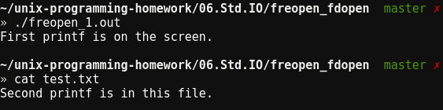
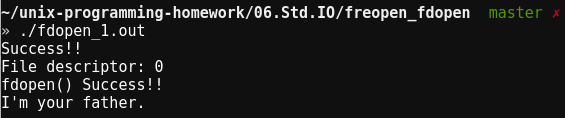

# freopen, fdopen functions
## NAME
freopen, fdopen - stream open functions
## SYNOPSIS
```
#include <stdio.h>
FILE *freopen(const char *pathname, const char *type, FILE *fp);
FILE *fdopen(int filedes, const char *type);
```
## RETURN VALUE
Return : file pointer if OK, NULL on error
## Description
* freopen(pathname, type, fp)
	* fp는 일반적으로 stdin, stdout, stderr 등과 같은 미리 정의된 스트림
	* type: fopen과 같음
	* 동작
		* fd = open(pathname, type);
		* dup2(fd, fp->_fileno);
	* -> 전형적으로 미리 정의된 스트림들 중 하나로 명시된 파일을 개방하고자 하는 경우 사용
* fdopen
	* 이미 열린 file descriptor에 대해 표준 입출력 스트림 연결 
## Screenshots
* freopen_1  

* fdopen_1  

